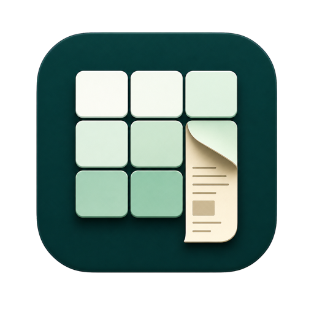

<div align="center">
  
  <h1>Gridnote</h1>
  <p><strong>把本地阅读放进一张看起来正在工作的表格里。</strong></p>
  <p>原生 macOS · TXT / EPUB · 摸鱼阅读 · 悬浮阅读 · 完全本地</p>

  [](https://github.com/ZOB2077/Gridnote/releases/latest)
  [](https://github.com/ZOB2077/Gridnote/actions/workflows/ci.yml)
  
  
  [](LICENSE)
</div>

> [!IMPORTANT]
> Gridnote 是源码可见的非商业项目，不是 OSI 定义的开源软件。个人、教育和研究用途可依许可使用；商业分发、付费服务、白标和其他获利用途需要单独授权。


## 为什么是 Gridnote

这是一个vibe项目，Gridnote 不尝试成为另一款电子书书城，也不复制完整 Excel。它只专注两件事：让本地小说快速、舒适地阅读，并让阅读窗口在桌面上保持低干扰。
希望在消磨生命的工作中，还能找到一点乐趣。

| 能力 | 体验 |
| --- | --- |
| 办公伪装 | 电子表格式工作区，使用全合成手机演示数据；正文位于顶部公式栏，不进入表格单元格。 |
| 悬浮阅读 | 可调尺寸、背景透明度、文字颜色、字号、行距和阅读进度。 |
| 超级隐蔽 | 去除背景、边框和组件，仅显示正文；支持单行范围和最大宽度。 |
| 本地优先 | 书籍、书签、进度、别名和设置仅保存在 Mac 本地，不需要账号或网络。 |
| 多格式 | 支持 TXT 与无 DRM EPUB；TXT 支持 UTF-8、UTF-16、GB18030 等常见编码。 |
| 连续进度 | 办公公式栏与悬浮窗共享阅读位置，切换模式后从同一处继续。 |

## 功能演示

### 1. 办公伪装：在顶部公式栏阅读

应用默认进入数据工作区。表格数据是AI生成的合成记录，不包含真实客户、订单或经营数据。顶部公式栏用于显示当前阅读片段，窗口标题不会暴露真实书名。

> **小说在哪里？** 在表格工具栏下方、`fx` 标记右侧的长编辑栏中。点击书库图标导入书籍后，使用 `F7` 和 `F8` 即可在这里翻页。


### 2. 普通悬浮阅读

悬浮窗直接显示正文、书名和精确进度，并提供搜索、书签、章节与排版入口。窗口大小、文字颜色和背景透明度均可调整，办公公式栏与悬浮窗共享同一阅读位置。


### 3. 超级隐蔽模式

开启后移除悬浮窗背景、边框和全部控制组件，只保留可调范围的正文。下图中的灰色小说文本就是无边框叠加层；翻页和显示隐藏通过菜单栏或全局快捷键完成。


### 4. 用全局快捷键控制阅读

| 快捷键 | 默认行为 |
| --- | --- |
| `F7` | 上一页；悬浮窗隐藏且 Gridnote 位于前台时控制公式栏。 |
| `F8` | 下一页；阅读位置自动保存并同步。 |
| `F9` | 在任何应用中显示或隐藏悬浮阅读。 |
| `⌘F` | 在当前可交互阅读界面打开全文搜索。 |
| `⌘B` | 添加或取消当前位置书签。 |

## 安装

1. 从 [最新正式版](https://github.com/ZOB2077/Gridnote/releases/latest) 下载 `Gridnote-macOS.dmg` 或 `Gridnote-macOS.zip`。
2. 将 `Gridnote.app` 移入“应用程序”。
3. 首次启动若被 macOS 阻止，请在 Finder 中右键选择“打开”，或前往“系统设置 → 隐私与安全性”确认打开。

当前附件为 Apple Silicon 架构，采用 ad-hoc 签名，尚未经过 Apple 公证。不要对来源不明的构建绕过 Gatekeeper。

## 使用

1. 点击工具栏中的书库图标，导入 TXT 或 EPUB。
2. 在办公公式栏中阅读，或点击悬浮图标打开悬浮阅读。
3. 使用 `F7`、`F8` 翻页，使用 `F9` 随时显示或隐藏。
4. 在设置中调整字体、颜色、透明度、失焦保护和超级隐蔽显示范围。

## 格式与边界

| 格式 | 状态 | 说明 |
| --- | --- | --- |
| TXT | 支持 | 编码识别、章节识别、搜索、书签和精确进度。 |
| EPUB | 支持 | 无 DRM EPUB 的正文、元数据、书脊和目录；不还原复杂 CSS。 |
| PDF | 不支持 | 请先转换为 TXT 或 EPUB。 |
| DRM 内容 | 不支持 | 不提供移除或绕过 DRM 的能力。 |

Gridnote 不提供完整 Excel 兼容、XLSX 导入导出、公式、宏、联网书城、账号、云同步、遥测、广告、监控检测或系统权限绕过。

## 隐私

- 阅读内容不会上传；应用核心功能离线可用。
- 内置表格和发布附件均为合成演示数据。


## 从源码构建

```bash
git clone https://github.com/ZOB2077/Gridnote.git
cd Gridnote
open Gridnote.xcodeproj
```

```bash
DEVELOPER_DIR=/Applications/Xcode.app/Contents/Developer \
xcodebuild -project Gridnote.xcodeproj -scheme Gridnote \
  -destination 'platform=macOS,arch=arm64' build
```

```bash
DEVELOPER_DIR=/Applications/Xcode.app/Contents/Developer \
xcodebuild -project Gridnote.xcodeproj -scheme Gridnote \
  -destination 'platform=macOS' -parallel-testing-enabled NO \
  -skip-testing:GridnoteUITests test
```

默认测试命令不运行 UI 自动化，避免 macOS 在测试过程中重复请求本地权限。人工验收范围见 [TEST_PLAN.md](TEST_PLAN.md)。

## 项目文档

- [产品规格](PRODUCT_SPEC.md)
- [技术架构](ARCHITECTURE.md)
- [测试计划](TEST_PLAN.md)
- [版本记录](CHANGELOG.md)
- [已知限制](KNOWN_LIMITATIONS.md)
- [贡献指南](CONTRIBUTING.md)
- [支持与反馈](SUPPORT.md)
- [安全策略](SECURITY.md)

## 许可与商业授权

Gridnote 使用 [Gridnote Source-Available Non-Commercial License v1.0](LICENSE)。允许个人、教育、研究、慈善和其他非商业用途查看、复制、修改和分发源码，但必须保留许可和版权声明。

商业分发、付费产品或服务、广告获利、OEM、白标及托管服务需要版权所有者单独书面授权。商业合作请通过 [ZOB2077](https://github.com/ZOB2077) 联系。

## 请我喝杯咖啡

如果 Gridnote 对你有帮助，可以通过微信支付自愿支持项目维护，一杯咖啡=拯救牛马一整天。

<p align="center">
  
</p>

> 捐赠完全自愿，不构成商业授权、付费服务、功能承诺或优先支持。商业用途仍需单独取得书面授权。

## 致谢

悬浮阅读功能参考了 MIT 许可项目 [StealthReader](https://github.com/mx3353672833-debug/StealthReader-moyu-reader-mac) 的产品思路，Gridnote 使用独立实现。详情见 [THIRD_PARTY_NOTICES.md](THIRD_PARTY_NOTICES.md)。
